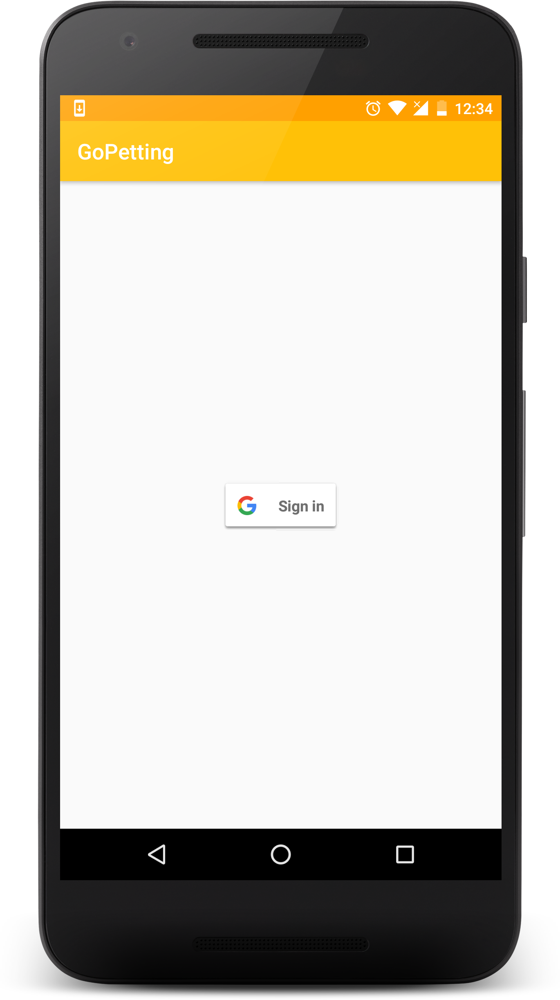
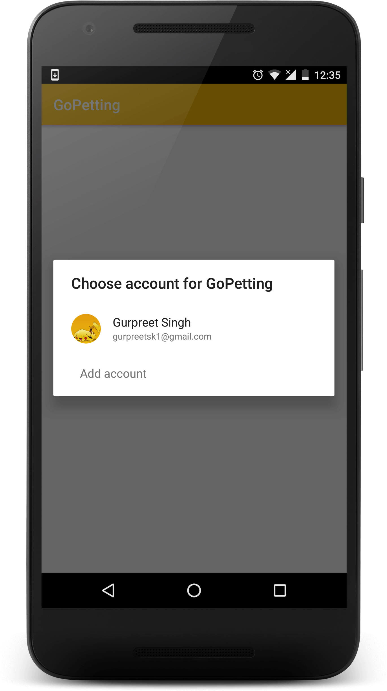
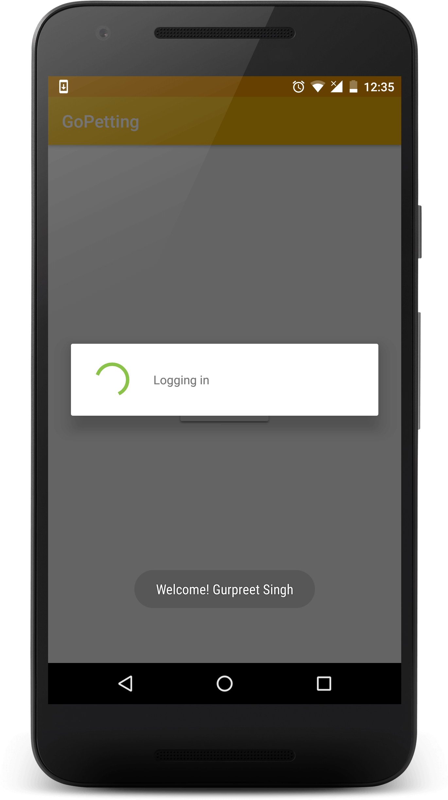
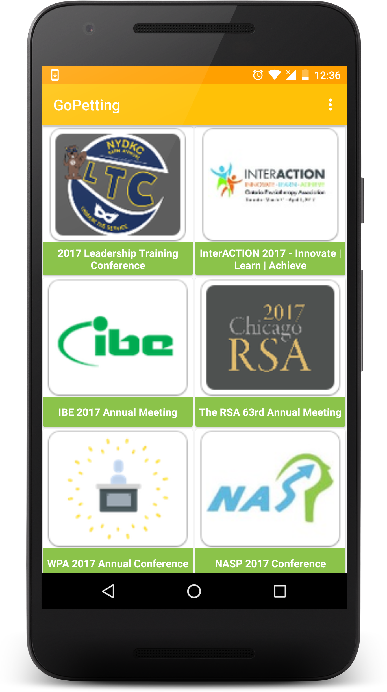
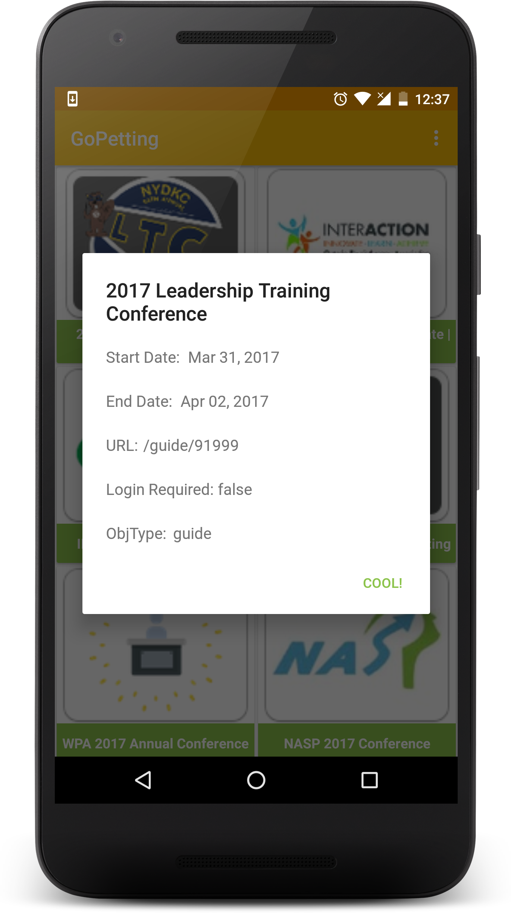
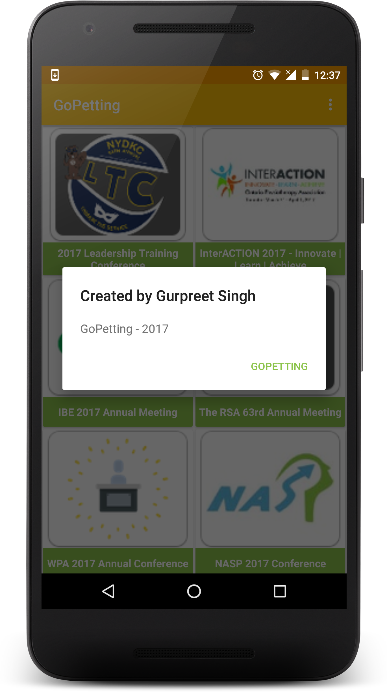

GoPetting- Android Hiring
=========================

[Android app](app/gopetting-release.apk) as per the challenge received in the e-mail.

Features:
---------
- **One-click login** with Google Sign-in
- Clean UI: uses **RecyclerView with GridLayoutManager** to layout data
- [**Volley**](https://developer.android.com/training/volley/index.html) for transmitting network data
- **Picasso** for image loading
- **SQLite** database for data persistence with **ContentProvider** for communication

Screenshots:
------------

    
    
    

    
    
    

